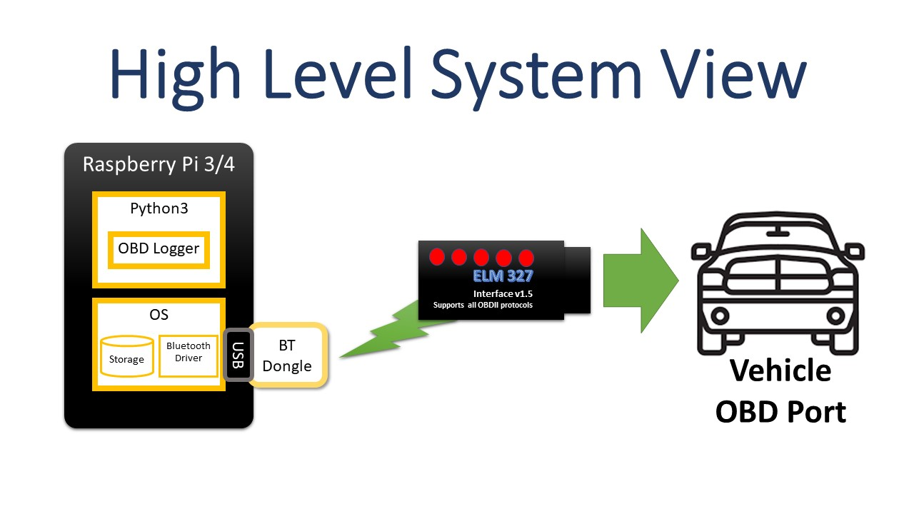
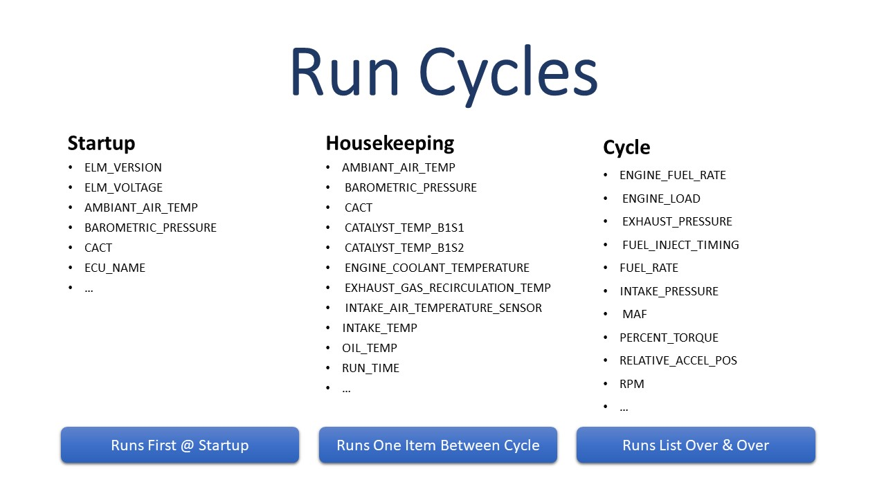
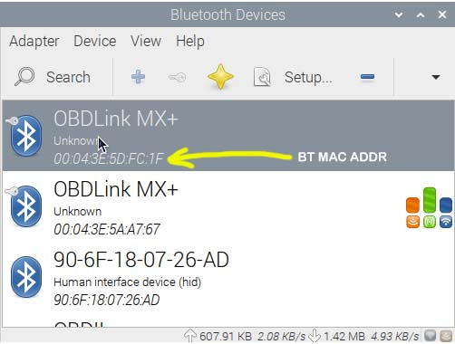
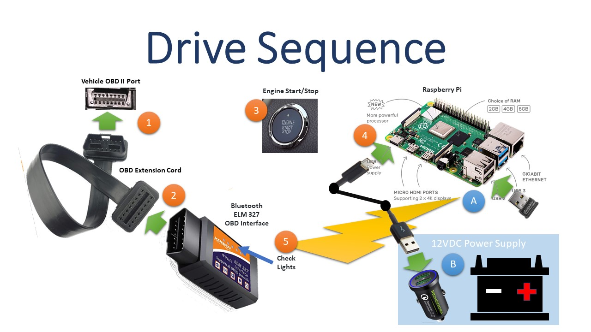
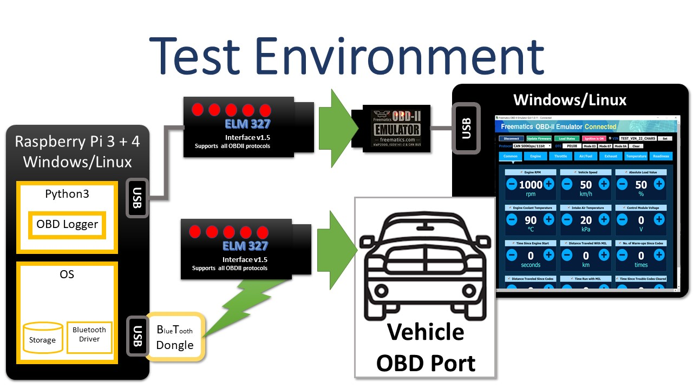

# Telemetry OBD Logger

The Telemetry OBD Logger captures vehicle performance data using an OBD interface device attached to the vehicle.  While the logger is running, it writes output to files.  Data from multiple vehicles can easily be logged.  Data from each different vehicle is stored in a directory/folder matching the vehicle's VIN or vehicle identification number.

The software is designed to run on Raspberry Pi with Raspberry Pi OS (formerly known as Raspbian) installed.  Bluetooth capabilities are added to the Raspberry Pi through a USB Bluetooth adapter (BT Dongle) and installed software (Bluetooth Driver and tools).

The OBD Logger software runs on Python versions 3.11 (optionally 3.10).



## OBD Logger

### Command Line Usage

The Telemetry OBD Logger application command line interface (CLI) is as follows:

```bash
$ python3.11 -m telemetry_obd.obd_logger --help
usage: obd_logger.py [-h] [--config_file CONFIG_FILE] [--config_dir CONFIG_DIR] [--full_cycles FULL_CYCLES] [--timeout TIMEOUT] [--logging] [--no_fast]
                     [--verbose]
                     [--version]
                     [base_path]

Telemetry OBD Logger

positional arguments:
  base_path             Relative or absolute output data directory. Defaults to 'data'.

options:
  -h, --help            show this help message and exit
  --config_file CONFIG_FILE
                        Settings file name. Defaults to '<vehicle-VIN>.ini' or 'default.ini'.
  --config_dir CONFIG_DIR
                        Settings directory path. Defaults to './config'.
  --full_cycles FULL_CYCLES
                        The number of full cycles before a new output file is started. Default is 50.
  --timeout TIMEOUT     The number seconds before the current command times out. Default is 1.0 seconds.
  --logging             Turn on logging in python-obd library. Default is off.
  --no_fast             When on, commands for every request will be unaltered with potentially long timeouts when the car doesn't respond promptly or at
                        all. When off (fast is on), commands are optimized before being sent to the car. A timeout is added at the end of the command.
                        Default is off.
  --output_file_name_counter
                        Base output file name on counter not timestamps
  --verbose             Turn verbose output on. Default is off.
  --version             Print version number and exit.
$
```

#### ```--timeout TIMEOUT```

The timeout value determines how long a read request can take between the underlying ```python-OBD``` library and the OBD reader device.  If one or more individual commands are causing problems by intermittently responding with ```"no response"``` instead of a real value, an increase in the ```timeout``` value may help alleviate the problem.

#### ```--no_fast```

```--no_fast``` can also be used to reduce the number of ```"no response"```s but be aware of the consequences.  For commands that are not available on the vehicle being instrumented, the software may just wait forever for a response that will never come.

#### ```--version```

Responds with the version and exits.

#### Telemetry OBD Logger Run Cycles

While logging, OBD Logger submits a pattern of OBD commands to the vehicle and stores the vehicle's responses.  There are three patterns:

- Startup
- Housekeeping
- Cycle



##### Startup

The startup list of OBD commands is only executed when the program starts up.  Typically, this list of OBD commands includes:

- OBD commands whose return values never change (e.g. ```ECU_NAME```, ```ELM_VERSION```, ```ELM_VOLTAGE```)
- OBD commands with slow changing return values that might be needed for startup baseline like ```AMBIANT_AIR_TEMP``` and ```BAROMETRIC_PRESSURE```.

##### Housekeeping

A list of OBD commands that have ("relatively") "slow changing" return values such as  ```AMBIANT_AIR_TEMP``` and ```BAROMETRIC_PRESSURE```.  These are commands that need to be run over and over again but in a slower loop.

##### Cycle

A list of OBD commands that have fast changing return values such as ```RPM```, ```MAF``` (Mass Air Flow) and ```PERCENT_TORQUE```.  The idea is for these commands to run over and over again in relatively fast loops.

##### Full Cycle

The repeating part of the OBD command pattern is called a "full cycle" and has OBD commands from Cycle executed in a group followed by the next Housekeeping command.  This basic pattern repeats over and over.  When the end of the Housekeeping commands is reached, a "Full Cycle" has been achieved.

The total number of command submissions in a full cycle is the ```count of commands in Housekeeping``` times (one plus the ```count of commands in Cycle```).

The ```--full_cycles``` parameter is used to set the number of ```full_cycles``` contained in output data files.  Once the ```--full_cycles``` limit is reached, the data file is closed and a new one is opened.  This keeps data loss from unplanned Raspberry Pi shutdowns to a minimum.

#### Telemetry OBD Logger Configuration Files

Configuration files are used to tell OBD Logger what OBD commands to send the vehicle and the order to send those commands in.  A sample configuration file is shown below and another one is included in the source code.

##### Default Configuration File

A default configuration file is included in the repository at ```config/default.ini```.  This configuration file contains most OBD commands.  There are wide variations in supported command sets by manufacturer, model, trim level and year.  By starting out with this configuration file, OBD Logger will try all commands.  After a full cycle is run, unsupported commands will respond with ```"obd_response_value": "no response"``` in the output data.  

Some commands will result in an OBD response value of ```"no response"``` (```"obd_response_value": "no response"```) when the vehicle is unable to satisfy the OBD data request quickly enough.  You can identify this problem by searching for all responses for a particular command and seeing if sometimes the command responds with ```"no response"``` or with a value.

For example, 2017 Ford F-450 truck ```FUEL_RATE``` command in the ```cycle``` section of the configuration file returned mixed results.  In 1,124 attempts, 1084 responded with a good value while 40 responded with ```no response```.

```bash
human@computer:data/FT8W4DT5HED00000$ grep FUEL_RATE FT8W4DT5HED00000-20210910204443-utc.json | grep "no response" | wc -l
40
human@computer:data/FT8W4DT5HED00000$ grep FUEL_RATE FT8W4DT5HED00000-20210910204443-utc.json | grep -v "no response" | wc -l
1084
```

This problem may be solved by increasing the OBD command timeout from its default to a higher value.  Use the ```--timeout``` setting when invoking the ```obd_logger``` command.

### Telemetry OBD Logger Output Data Files

Output data files are in a hybrid format.  Data files contain records separated by line feeds (```LF```) or carriage return and line feeds (```CF``` and ```LF```).  The records themselves are formatted in JSON.  Sample output follows:

```json
{"command_name": "AMBIANT_AIR_TEMP", "obd_response_value": "25 degC", "iso_ts_pre": "2020-09-09T15:38:29.114895+00:00", "iso_ts_post": "2020-09-09T15:38:29.185457+00:00"}<CR>
{"command_name": "BAROMETRIC_PRESSURE", "obd_response_value": "101 kilopascal", "iso_ts_pre": "2020-09-09T15:38:29.186497+00:00", "iso_ts_post": "2020-09-09T15:38:29.259106+00:00"}<CR>
{"command_name": "CONTROL_MODULE_VOLTAGE", "obd_response_value": "0.0 volt", "iso_ts_pre": "2020-09-09T15:38:29.260143+00:00", "iso_ts_post": "2020-09-09T15:38:29.333047+00:00"}<CR>
{"command_name": "VIN", "obd_response_value": "TEST_VIN_22_CHARS", "iso_ts_pre": "2020-09-09T15:38:30.029478+00:00", "iso_ts_post": "2020-09-09T15:38:30.061014+00:00"}
{"command_name": "FUEL_STATUS", "obd_response_value": "no response", "iso_ts_pre": "2020-09-09T15:38:29.771997+00:00", "iso_ts_post": "2020-09-09T15:38:29.824129+00:00"}
```

#### JSON Fields

- ```command_name```
  OBD command name submitted to vehicle.

- ```obd_response_value```
  OBD response value returned by the vehicle.  When the OBD command gets no response, the response is ```"no response"```.  Response values are either a string like ```"no response"``` and ```"TEST_VIN_22_CHARS"``` or they are a [Pint](https://pint.readthedocs.io/en/stable/) encoded value like ```"25 degC"``` and ```"101 kilopascal"```.

  Some OBD commands will respond with multiple values in a list.  The values within the list can also be Pint values.  This works just fine in JSON but the code reading these output files will need to be able to manage embedded lists within the response values.  [Telemetry OBD Data To CSV File](https://github.com/thatlarrypearson/telemetry-obd-log-to-csv) contains two programs, ```obd_log_evaluation``` and ```obd_log_to_csv```, providing good examples of how to handle multiple return values.

- ```iso_ts_pre```
  ISO formatted timestamp taken before the OBD command was issued to the vehicle (```datetime.isoformat(datetime.now(tz=timezone.utc))```).

- ```iso_ts_post```
  ISO formatted timestamp taken after the OBD command was issued to the vehicle (```datetime.isoformat(datetime.now(tz=timezone.utc))```).

[Pint](https://pint.readthedocs.io/en/stable/) encoded values are strings with a numeric part followed by the unit.  For example, ```"25 degC"``` represents 25 degrees Centigrade.  ```"101 kilopascal"``` is around 14.6 PSI (pounds per square inch).  Pint values are used so that the units are always kept with the data and so that unit conversions can easily be done in downstream analysis software.  These strings are easy to deserialize to Pint objects for use in Python programs.

### Telemetry OBD Logger Debug Output

OBD Logger provides additional information while running when the ```--verbose``` option is used.  Additionally, The underlying python ```obd``` library (```python-obd```) supports detailed low-level logging capabilities which can be enabled within OBD Logger with the ```--logging``` option.

Sample ```--logging``` output follows:

```text
[obd.obd] ======================= python-OBD (v0.7.1) =======================
INFO:obd.obd:======================= python-OBD (v0.7.1) =======================
[obd.obd] Using scan_serial to select port
INFO:obd.obd:Using scan_serial to select port
[obd.obd] Available ports: ['/dev/rfcomm0']
INFO:obd.obd:Available ports: ['/dev/rfcomm0']
[obd.obd] Attempting to use port: /dev/rfcomm0
INFO:obd.obd:Attempting to use port: /dev/rfcomm0
[obd.elm327] Initializing ELM327: PORT=/dev/rfcomm0 BAUD=auto PROTOCOL=auto
INFO:obd.elm327:Initializing ELM327: PORT=/dev/rfcomm0 BAUD=auto PROTOCOL=auto
[obd.elm327] Response from baud 38400: b'\x7f\x7f\r?\r\r>'
DEBUG:obd.elm327:Response from baud 38400: b'\x7f\x7f\r?\r\r>'
[obd.elm327] Choosing baud 38400
DEBUG:obd.elm327:Choosing baud 38400
[obd.elm327] write: b'ATZ\r'
DEBUG:obd.elm327:write: b'ATZ\r'
[obd.elm327] wait: 1 seconds
DEBUG:obd.elm327:wait: 1 seconds
[obd.elm327] read: b'ATZ\r\r\rELM327 v1.5\r\r>'
DEBUG:obd.elm327:read: b'ATZ\r\r\rELM327 v1.5\r\r>'
[obd.elm327] write: b'ATE0\r'
DEBUG:obd.elm327:write: b'ATE0\r'
[obd.elm327] read: b'ATE0\rOK\r\r'
DEBUG:obd.elm327:read: b'ATE0\rOK\r\r'
[obd.elm327] write: b'ATH1\r'
DEBUG:obd.elm327:write: b'ATH1\r'
[obd.elm327] read: b'OK\r\r>'
DEBUG:obd.elm327:read: b'OK\r\r>'
[obd.elm327] write: b'ATL0\r'
```

### OBD Logger Data File Naming Convention

See [Telemetry System Boot and Application Startup Counter](https://github.com/thatlarrypearson/telemetry-counter).

## Testing All Available OBD Commands To See Which Ones Work On Your Vehicle

```Telemetry OBD Command Tester``` can be used to determine which set of OBD commands are supported by a given vehicle.

```bash
$ python3.11 -m telemetry_obd.obd_command_tester --help
usage: obd_command_tester.py [-h] [--base_path BASE_PATH] [--cycles CYCLES] [--timeout TIMEOUT] [--logging] [--no_fast] [--verbose]

Telemetry OBD Command Tester

optional arguments:
  -h, --help            show this help message and exit
  --base_path BASE_PATH
                        Relative or absolute output data directory. Defaults to 'data'.
  --cycles CYCLES       The number of cycles before ending. A cycle consists of all known OBD commands. Default is 10.
  --timeout TIMEOUT     The number seconds before a command times out. Default is 0.5 seconds.
  --logging             Turn on logging in python-obd library. Default is off.
  --no_fast             When on, commands for every request will be unaltered with potentially long timeouts when the car
                        doesn't respond promptly or at all. When off (fast is on), commands are optimized before being
                        sent to the car. A timeout is added at the end of the command. Default is off so fast is on.
  --output_file_name_counter
                        Base output file name on counter not timestamps
  --verbose             Turn verbose output on. Default is off.
```

The output file format is the same as ```telemetry_obd.obd_logger``` as are many of the command line arguments.  ```--cycles``` determines the number of times the full list of known OBD commands is tried.  The OBD command list needs to be run a number of times because vehicles don't alway respond to requests in a timely manner.

Test output files are named differently than ```obd_logger``` data files.   Both test and ```obd_logger``` data files will be placed in the ```{BASE_PATH}/{VIN}``` directory.  For example, using ```data``` (default) as the base path, if the vehicle VIN is ```FT8W4DT5HED00000```, then test files will be of the form ```data/FT8W4DT5HED00000/FT8W4DT5HED00000-TEST-20211012141917-utc.json```.  The ```obd_logger``` files will be of the form ```data/FT8W4DT5HED00000/FT8W4DT5HED00000-20211012141917-utc.json```.

## Issues Surfaced During Vehicle Testing

*IMPORTANT!*   Some vehicle identification numbers (VIN) are known to drop characters when being recorded.  Not to worry as the recorded VIN is still *VERY* *UNLIKELY* to overlap with another vehicle's VIN (unless you are working with thousands of vehicles).  VIN data is provided by the ```python-obd``` library.

* 2017 Ford F-450 VIN is missing leading ```1``` digit/letter
  * ```1FT8W4DT5HED00000``` is recorded as ```FT8W4DT5HED00000```
* 2013 Jeep Wrangler Rubicon VIN is missing leading ```1```  and trailing 2 digits/letters
  * ```1C4HJWCG5DL500000``` is recorded as  ```C4HJWCG5DL5000```
* 2021 Toyota Sienna Hybrid LE is missing the trailing ```0``` digit/letter
  * ```5TDKRKEC3MS042260``` is recorded as ```5TDKRKEC3MS04226```

*IMPORTANT!* Calibration Verification Numbers (CVN) come in 4 byte sets.  Multiple CVN (more than 4) can be returned through a single CVN command.  As a result, the CVN data isn't likely to be valid as provided by the ```python-obd``` library.

*IMPORTANT!* Calibration IDs (CALIBRATION_ID) come in 16 byte sets.  Multiple CALIBRATION_ID (more than 4) can be returned through a single CALIBRATION_ID command.  As a result, the CALIBRATION_ID data isn't likely to be valid as provided by the ```python-obd``` library.

Problems like the above can be found by running ```telemetry_obd.obd_logger``` and ```telemetry_obd.obd_command_tester``` with the ```--logging``` and ```--verbose``` command line arguments.  Look for "```DEBUG:obd.OBDCommand:Message was longer than expected```" in the output.

## Configuration File Creation and Validation

When a VIN (vehicle identification number) specific configuration file doesn't exist, the OBD Logger program defaults to using the ```"default.ini"``` configuration file.  This file, included in the software distribution under ```"config/default.ini"``` contains most known OBD commands.  Because of the wide variations in supported command sets by manufacturer, model, trim level and year made, it is difficult to know what OBD commands a specific car will respond to. Additionally, manufacturers don't typically publish lists of valid OBD commands for each vehicle sold.  This "try-them-all" method seems to be the only approach to identifying which OBD commands a specific vehicle will respond to.

The preferred way to *"try-them-all"*, that is try every known OBD command, is to use the ```telemetry_obd.obd_command_tester``` program. Once all the possible known OBD commands have been tried, it becomes possible to create a list of valid known commands to be used in the creation of a vehicle specific configuration file.  The OBD Logger software was written to automatically choose configuration files appropriately named ```"<VIN>.ini"``` by default.  If the ```"<VIN>.ini"``` isn't available, then the other default, ```"default.ini"```, is chosen.

Analysis of ```telemetry_obd.obd_command_tester``` and ```telemetry_obd.obd_logger``` output is done by ```telemetry_obd_log_to_csv.obd_log_evaluation``` found in the [Telemetry OBD Data To CSV File](https://github.com/thatlarrypearson/telemetry-obd-log-to-csv) repository.

When creating vehicle specific configuration files, use ```obd_log_evaluation``` to determine the list of commands providing valid vehicle responses.  Only valid OBD commands should be used long term when gathering vehicle data.

## Raspberry Pi System Installation

The recommended Raspberry Pi system is a [Raspberry Pi 4 Model B](https://www.raspberrypi.com/products/raspberry-pi-4-model-b/), [Raspberry Pi 400](https://www.raspberrypi.com/products/raspberry-pi-400/) or Raspberry Pi 5 with 4 GB RAM or more.  The full 64 bit release of [Raspberry Pi OS](https://www.raspberrypi.com/software/) version 12 (bookworm) or newer, including the GUI is the recommended operating system.  When choosing a [Micro-SD card](https://en.wikipedia.org/wiki/SD_card) for storage, look for Internet resources like [Best microSD Cards for Raspberry Pi & SBCs](https://bret.dk/best-raspberry-pi-micro-sd-cards/) as a guide to making an appropriate selection.  Select cards 32 GB or larger.

After installing Raspberry Pi OS on a Raspberry Pi 4 computer,  update the operating system to the newest version.  One way to do this is as follows:

```bash
# update and upgrade Linux/Raspberry Pi OS
sudo apt-get update
sudo apt-get upgrade -y
sudo apt-get autoremove -y
sudo shutdown -r now
sudo apt-get dist-upgrade -y
sudo shutdown -r now
```

Install useful software:

```bash
# git software
sudo apt-get install -y git
```

### Bluetooth Software

Install the Bluetooth support software and then reboot the system:

```bash
# Bluetooth support software
sudo apt-get install -y bluetooth bluez bluez-tools blueman bluez-hcidump
# Bluetooth support software requires reboot to become activated
sudo shutdown -r now
```

### Pairing Bluetooth OBD Devices

Bluetooth OBD adapters must be *paired* and *trusted* before they can be used.  The *pairing* and *trust* process is covered in [Pairing Bluetooth OBD Devices](./docs/README-BluetoothPairing.md).

### Bluetooth Trouble

After operating system upgrades, Bluetooth may not operate as expected.  Possible solutions may include

- Completely un-pair/remove OBD adapter from Bluetooth configuration followed by a reboot.  Next, boot the system and follow the [Bluetooth pairing instructions](./docs/README-BluetoothPairing.md).
- Follow instructions in [Use app to connect to pi via bluetooth](https://forums.raspberrypi.com/viewtopic.php?p=947185#p947185).

### Python 3.11

Validate that your Raspberry Pi has Python version 3.11 available:

```bash
# Python 3 version
human@hostname:~$ python3 --version
Python 3.6.9
# Python 3.11 version
human@hostname:~$ python3.11 --version
Python 3.11.5
human@hostname:~$
```

The latest Raspberry Pi OS version ```Bookworm (12.2)```, ships with Python 3.11 but don't use it.  It has a new feature that will prevent you from using ```pip``` to download necessary Python packages.  Instead, download/make/install Python 3.11 from source following the instructions below.

```bash
# Python 3 version on Rasberry Pi OS Bookworm Version 12.2
human@hostname:~$ python3 --version
Python 3.11.2
human@hostname:~$
```

If *Python 3.11*, isn't already installed you will need to compile it from source before installing it.  Follow the [Python 3.11 Install Instructions](docs/Python311-Install.md) to download, compile and install the preferred Python 3.11.

Alternatively, you may follow the [Python 3.10 Install Instructions](docs/Python310-Install.md) to download, compile and install Python 3.10.

### Installing ```telemetry_obd``` Package

```bash
# get latest version of this software from github repository
git clone https://github.com/thatlarrypearson/telemetry-obd.git
cd telemetry-obd
python3.11 -m build
python3.11 -m pip install --user dist/telemetry_obd-0.4.2-py3-none-any.whl

# make shell programs executable
chmod 0755 bin/*.sh
cd
```

On Windows 10, connecting to USB or Bluetooth ELM 327 OBD interfaces is simple.  Plug in the USB and it works.  Pair the Bluetooth ELM 327 OBD interface and it works.  Linux and Raspberry Pi systems are a bit more challenging.

On Linux/Raspberry Pi based systems, USB ELM 327 based OBD interfaces present as ```tty``` devices (e.g. ```/dev/ttyUSB0```).  If software reports that the OBD interface can't be accessed, the problem may be one of permissions.  Typically, ```tty``` devices are owned by ```root``` and group is set to ```dialout```.  The user that is running the OBD data capture program must be a member of the same group (e.g. ```dialout```) as the ```tty``` device.

```bash
# add dialout group to the current user's capabilities
sudo adduser $(whoami) dialout
```

On Linux/Raspberry Pi, Bluetooth serial device creation is not automatic.  After Bluetooth ELM 327 OBD interface has been paired, ```sudo rfcomm bind rfcomm0 <BT-MAC-ADDRESS>``` will create the required serial device.   An example follows:

```bash
# get the Bluetooth ELM 327 OBD interface's MAC (Media Access Control) address
sudo bluetoothctl
[bluetooth]# devices
Device 00:00:00:33:33:33 OBDII
[bluetooth]# exit
# MAC Address for OBD is "00:00:00:33:33:33"

# bind the Bluetooth ELM 327 OBD interface to a serial port/device using the interfaces Bluetooth MAC (Media Access Control) address:
sudo rfcomm bind rfcomm0 00:00:00:33:33:33
```

Realize that before the above can work, the Bluetooth device must have already been paired to the Raspberry Pi.  One easy way to pair is to use the Raspberry Pi's GUI to access the Bluetooth.  The *pairing* and *trust* process is covered in [Pairing Bluetooth OBD Devices](./docs/README-BluetoothPairing.md).


On Linux/Raspberry Pi systems, the ```rfcomm``` command creates the device ```/dev/rfcomm0``` as a serial device owned by  ```root``` and group ```dialout```.  If multiple Bluetooth serial devices are paired and bound to ```/dev/rfcomm0```, ```/dev/rfcomm1```, ```/dev/rfcomm2``` and so on, OBD Logger will only automatically connect to the first device.  The code can be modified to resolve this limitation.

Regardless of connection type (USB or Bluetooth) to an ELM 327 OBD interface, the serial device will be owned by ```root``` with group ```dialout```.  Access to the device is limited to ```root``` and users in the group ```dialout```.

Users need to be added to the group ```dialout```.  Assuming the user's username is ```human```:

```bash
human@hostname:~ $ ls -l /dev/ttyUSB0
crw-rw---- 1 root dialout 188, 0 Aug 13 15:47 /dev/ttyUSB0
human@hostname:~ $ ls -l /dev/rfcomm0
crw-rw---- 1 root dialout 120, 0 Aug 13 15:47 /dev/rfcomm0
human@hostname:~ $ sudo adduser human dialout
```

## Headless Operation On Raspberry Pi

In order to reliably run in an automotive environment, the OBD Logger application needs to start automatically after all preconditions are satisfied.  That is, the application must start without any user interaction.  The trigger for starting the application is powering up the Raspberry Pi system.

### ```/etc/rc.local```

On the Raspberry Pi, commands embedded in "```/etc/rc.local```" will be run at the end of the system startup sequence by the ```root``` user.  A sample "```/etc/rc.local```" follows:

```bash
#!/bin/sh -e
#
# rc.local
#
# This script is executed at the end of each multiuser runlevel.
# Make sure that the script will "exit 0" on success or any other
# value on error.
#
# In order to enable or disable this script just change the execution
# bits.
#
# By default this script does nothing.

# Print the IP address
_IP=$(hostname -I) || true
if [ "$_IP" ]; then
  printf "My IP address is %s\n" "$_IP"
fi

# BEGIN TELEMETRY-OBD SUPPORT

/bin/nohup "/root/bin/telemetry.rc.local.obd" &

# END TELEMETRY-OBD SUPPORT

exit 0
```

```/etc/rc.local``` invokes ```/root/bin/telemetry.rc.local```.  The functionality in ```/root/bin/telemetry.rc.local``` is not placed in ```/etc/rc.local``` for these reasons:

* Rasberry Pi OS (```Bullseye```) invokes /etc/rc.local with ```/bin/sh``` (soft link to ```/bin/dash```) which is not the same as ```/usr/bin/bash```, the required shell.
* ```/bin/sh``` is invoked with ```-e``` flag meaning that ```/etc/rc.local``` will stop execution when a pipe fails.  See [bash documentation](https://www.gnu.org/software/bash/manual/bash.pdf).
* The command ```bluetoothctl```, required to automatically detect and connect to the correct Bluetooth device, generates a pipe failure fault when run in ```/etc/rc.local```.  It will run fine as ```root``` in the terminal.

### ```telemetry-obd/root/bin/telemetry.rc.local.obd```

```telemetry-obd/root/bin/telemetry.rc.local.obd``` must be run as root.  Once the Bluetooth subsystem is configured correctly, it invokes ```bin/obd_logger.sh``` which invokes ```obd_logger.py``` provided in this distribution.

Shell variables, like ```OBD_USER``` must be changed in ```root/bin/telemetry.rc.local``` to match the target system.  The line ```for BT_MAC_ADDR in "00:04:3E:5A:A7:67" "00:19:5D:26:4B:5F"``` must also be changed.  the Bluetooth Media Access Control layer addresses (```"00:04:3E:5A:A7:67" and "00:19:5D:26:4B:5F"```) will need changing to match the target Bluetooth OBD dongle devices.  This address, like an Internet address, must match your current configuration.  Assuming your Bluetooth OBD adapter is currently paired to your Raspberry Pi, click on the Bluetooth icon on your Raspberry Pi desktop and select the ```Devices``` option.



The yellow arrow points to where the Bluetooth MAC address is found on the ```Devices``` dialog box.

The ```runuser``` command in "```telemetry-obd/root/bin/telemetry.rc.local.obd```" file runs the "```telemetry-obd/bin/obd_logger.sh```" ```bash``` shell program as user "```human```" and group "```dialout```".

Once the ```telemetry-obd/root/bin/telemetry.rc.local.obd``` file has been modified, it must be copied to ```/root/bin``` and the file permissions changed:

```bash
$ cd
$ cd telemetry-obd/root/bin
$ sudo mkdir /root/bin
$ sudo cp telemetry.rc.local.obd /root/bin
$ sudo chmod 0755 /root/bin/telemetry.rc.local.obd
$ sudo ls -l /root/bin/telemetry.rc.local.obd
$ sudo ls -l /root/bin/telemetry.rc.local.obd
-rwxr-xr-x 1 root root 1503 May 31 10:16 /root/bin/telemetry.rc.local.obd
$
```

Make both ```obd_logger.sh``` and ```obd_tester.sh``` executable by using the command ```chmod +x obd_logger.sh obd_tester.sh```.

## Date/Time Accuracy During Data Collection

After the power has been off, an unmodified Raspberry Pi will do one of the following to determine the time it starts up with:

- starts up with the time value stored on disk
- goes out to the Internet to a Network Time Protocol (NTP) server to get the current time

While the Raspberry Pi runs, time updates as expected in its built-in clock and it periodically saves the current time value to disk.  Because the built-in clock only works while the power is on, when the power goes off, the clock stops working.  When power comes back on, the clock starts up from zero time.  During the boot process, the clock gets updated from the disk and later, after the network starts up, an NTP server.  No network, no time update.

Each bit of data collected is collected with timestamps.  Data and log file names have embedded timestamps in them.  When the clock is hours or even weeks behind the actual time, data analysis becomes more difficult as it is hard to connect OBD data with driver activity such as stops for fuel or stops at destinations.

One solution to consider is to always provide the Raspberry Pi with Internet access, especially during the boot process.  For example, mobile phones (with the correct carrier plan) support mobile WIFI hotspot capability.  In iPhone settings, this shows up in the **Settings** app as **Personal Hotspot**.

On an iPhone, the **Personal Hotspot** times out and goes to sleep when no devices are connected to it.  Before starting the vehicle, disable the hotspot and reenable it through the iPhone **Settings** app.  This approach worked flawlessly on a two day, 1,000 mile trip with seven fuel stops, one overnight stop and several random health stops.

Running Raspberry Pi's in headless mode requires WIFI to be configured in advance.  For example, put each phone or tablet into mobile hotspot mode and then configure the Raspberry Pi to automatically connect to them before using the logging system in a vehicle.

A possible solution is to use add a GPS receiver to the Raspberry Pi to add [Stratum-1 NTP Server](https://www.satsignal.eu/ntp/Raspberry-Pi-NTP.html) capability to the Raspberry Pi.  This works in remote environments were mobile wireless signals are unavailable.  It also requires less work on behalf of the vehicle operator.

The solution currently in use a Raspberry Pi UPS HAT with a built-in real-time clock.  This option, using the [Raspberry Pi UPS HAT](https://www.pishop.us/product/raspberry-pi-ups-hat/) had been working well with no operator intervention required.  However, once the Lithium battery got funky, the built-in real-time clock often lost power.  Power loss resets the clock to 1970 almost every time the system boots.

In environments where the following are unavailable:

- battery backed real-time clock
- Internet access
- GPS coupled with local Stratum-1 NTP Server

The function ```get_output_file_name()``` from [Telemetry System Boot and Application Startup Counter](https://github.com/thatlarrypearson/telemetry-counter) has been added to ```obd_logger``` and ```obd_tester``` to ensure the creation of data files with unique invariant identifiers.  These file names assure that data files can be processed in the order they were created.  For the file naming to work properly, ```obd_logger``` and ```obd_tester``` need to be started through the bash startup programs found in ```telemetry-obd/bin/```  named ```obd_logger.sh``` and ```obd_tester.sh```.

Data timestamp information may still need downstream processing using embedded GPS data to recalibrate system timestamp data.  Examples for this type of downstream processing can be found in the ```obd_log_to_csv``` package.  See [Telemetry OBD Data To CSV File](https://github.com/thatlarrypearson/telemetry-obd-log-to-csv).

## Running Raspberry Pi In Vehicle

Getting the Raspberry Pi and OBD interface to work reliably in running vehicles turned out to be problematic.  The initial setup used a USB OBD interface.  The thinking was that a hard wired USB connection between the Raspberry Pi and the ODB interface would be simpler and more reliable.  On the 2013 Jeep Wrangler Rubicon, this was true.  The 110 VAC power adapter was plugged into the Jeep's 110 VAC outlet.

However, both the 2017 Ford F-450 Truck and 2019 Ford EcoSport SUV wouldn't power the Raspberry Pi if it was connected via USB to an OBD interface.  It didn't matter if the Pi was plugged into 12 VDC or 110 VAC  outlets.  It wasn't until a 600 Watt Sine Wave Inverter was used to power the Raspberry Pi that the underlying problem became clear.  The inverter has [GFCI](https://www.bobvila.com/articles/gfci-outlets/) circuitry that tripped soon after the Raspberry Pi started communicating through USB to the OBD interface.  There wasn't adequate electrical isolation between the vehicle OBD port and the Raspberry Pi.

Given that electrical isolation was an issue, it became clear that wireless connection between components would be necessary.  This is why Bluetooth became the preferred solution.

Depending on the power supply powering the Raspberry Pi, there may also be issues with power when powering the Pi directly through the vehicle.  Switching to a portable 12 VDC battery also made the solution more stable.

## Driver Responsibilities



Before turning on the ignition:

- (Optional) Enable mobile hotspot
- Plug OBD extension cord into vehicle OBD port.
- Plug Bluetooth ELM 327 OBD interface into OBD extension cord.
- Turn on vehicle ignition and start the vehicle.

After vehicle is running:

- Connect Bluetooth enabled Raspberry Pi to power.
- Watch Bluetooth ELM 327 OBD interface lights to ensure that the Raspberry Pi is interacting with the interface within a minute or two.  No flashing lights indicates failure.

After turning off the vehicle:

- Disconnect power from Raspberry Pi.

## Software Testing

Software was tested manually using a [Freematics OBD-II Emulator](https://freematics.com/products/freematics-obd-emulator-mk2/) (vehicle emulator) as well as in actual vehicles.  The test environment is as follows:



The Freematics OBD-II Emulator does not cover all available OBD commands.  This is especially true for the additional commands provided through ```add_commands.py```.  Be aware that actual vehicle responses may not match the software.  Also be aware that test code coverage in ```add_commands.py``` is sketchy at best.  Your mileage may vary.

## Manufacturer Warranty Information

The 2019 Ford EcoSport manual has the following statement with respect to aftermarket OBD devices:

"_Your vehicle has an OBD Data Link
Connector (DLC) that is used in
conjunction with a diagnostic scan tool for
vehicle diagnostics, repairs and
reprogramming services. Installing an
aftermarket device that uses the DLC
during normal driving for purposes such as
remote insurance company monitoring,
transmission of vehicle data to other
devices or entities, or altering the
performance of the vehicle, may cause
interference with or even damage to
vehicle systems. We do not recommend
or endorse the use of aftermarket plug-in
devices unless approved by Ford. The
vehicle Warranty will not cover damage
caused by an aftermarket plug-in device._"

You use this software at your own risk.

## LICENSE

[MIT License](./LICENSE.md)
