# Pairing Bluetooth OBD Devices

When purchasing Bluetooth OBD devices, ensure that each device is supported by the operating system.

At some point, the Raspberry Pi 4 will need to pair with an OBD Interface that is compatible with the ```python-obd``` software library.  Look for Bluetooth OBD interface hardware based on [ELM 327](https://www.elmelectronics.com/products/ics/obd/) chips at version 1.5 or greater.  At the time you read this, ELM may be out of business.

Newer Bluetooth OBD interfaces use different chip sets which work so long as they support the ELM 327 command language.  E.g. [OBDLink MX+](https://www.obdlink.com/products/obdlink-mxp/) uses the [STN2100 MULTI-PROTOCOL OBD INTERPRETER IC](https://www.obdsol.com/solutions/chips/stn2100/) chip set family to good effect.

When an OBD interface emulator is available, pairing the OBD device to the Raspberry Pi worked fine using the pairing program accessible through the Pi's GUI.  The only complaint is there isn't much time to pair.  In general, from the time the OBD interface is plugged into either the car or the emulator, there is less than 20 seconds to complete the pairing before the OBD interface turns off pairing.  It can take a few attempts to pair.

Pairing with the OBD device plugged into a vehicle is considerably more challenging.  OBD interface extension cords are available.  Extension cords are useful because the lights on the OBD interface can be seen.  These lights are important while trying to pair.  Lights also blink when the Pi is communicating to the OBD interface.

One important tip for Bluetooth pairing: the process works better when the Bluetooth device is less than 30 feet from the computer.  Pairing also works better with clear line of sight between device and computer.

Starting over with the pairing process is easy.  Just unplug the OBD device from the car and plug it back in five seconds later.

After the Bluetooth software has been installed and the system rebooted, look for the Bluetooth icon in the upper right hand area of the display (green arrow).


Plug your Bluetooth OBD dongle into an OBD interface and if there is a pairing button to press, press it.


Click on the Bluetooth icon and select *Devices*.  A dialog box containing paired devices will be displayed.

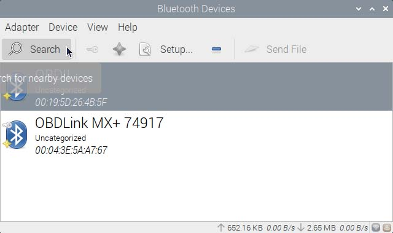

In the dialog box, select *Search*.  This will show both paired and unpaired Bluetooth devices.  Look for *OBD* devices.

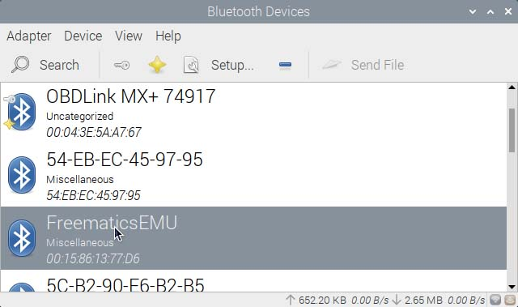

*Search* shows paired and unpaired devices.  Paired devices have *keys* and *stars* on their right.  Find the device to pair and right-click.

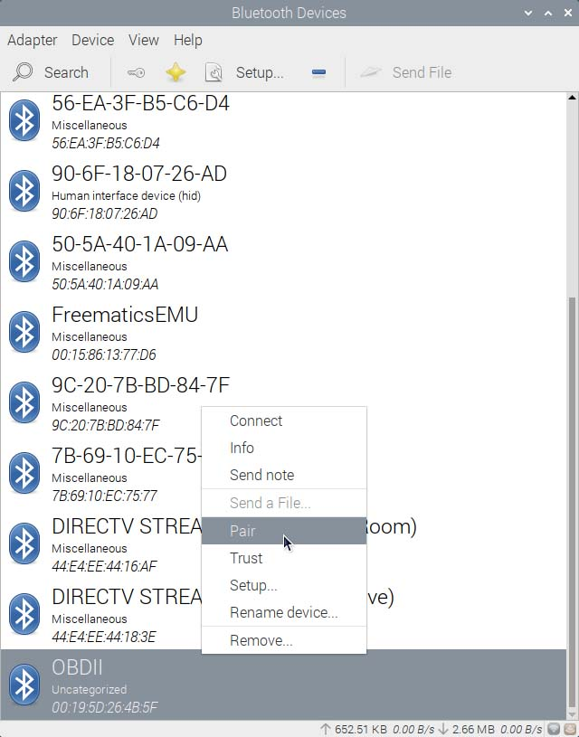

Then select *Pair* from the dropdown.

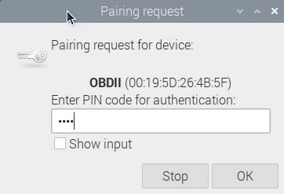

The *Pairing Request* dialog will require a PIN code to authenticate the Raspberry Pi to the Bluetooth device.  This particular OBD dongle cost $15 on Amazon years ago and has the simple PIN code of *1234*.  Generally, the PIN codes come in the same package as the OBD adapter.

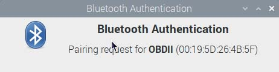

Successful pairings provide a *Bluetooth Authentication* notification dialog.  Note the MAC (Media Access Control) address to the right, formatted as six pairs of hex digits (*0123456789ABCDEF*).  Write this address down.  It will be needed in future steps.

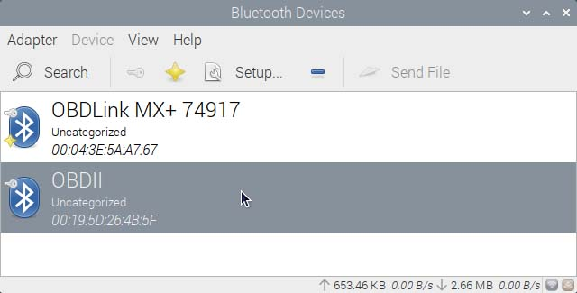

The *key* has shown up on the newly paired/authenticated device.  However, there is no *star*.

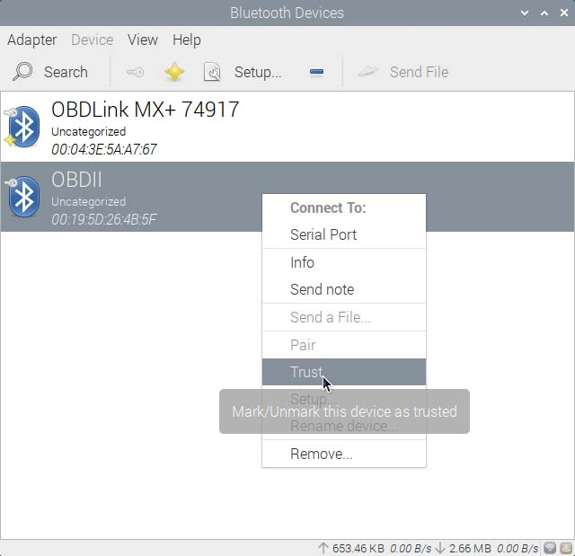

To trust a device, earning a *star*, right-click on the device and select *Trust*.

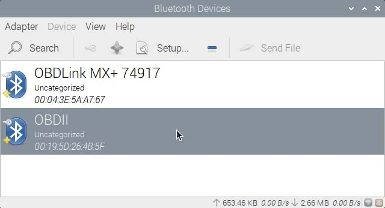

Since the device is now *paired* and *trusted*, it is almost ready for use.

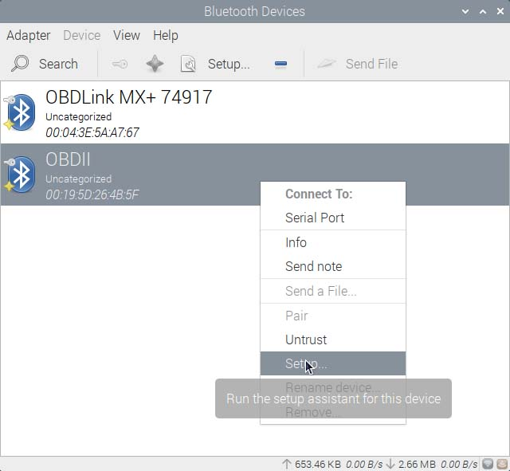

To use this device right now, a serial device must be associated with it.  Right-click on the device and select *Setup* from the dropdown menu.

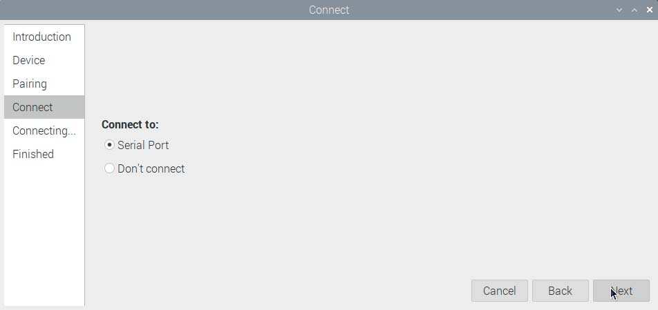

In the *Connect* dialog, select *Serial Port* as shown and click *Next*.

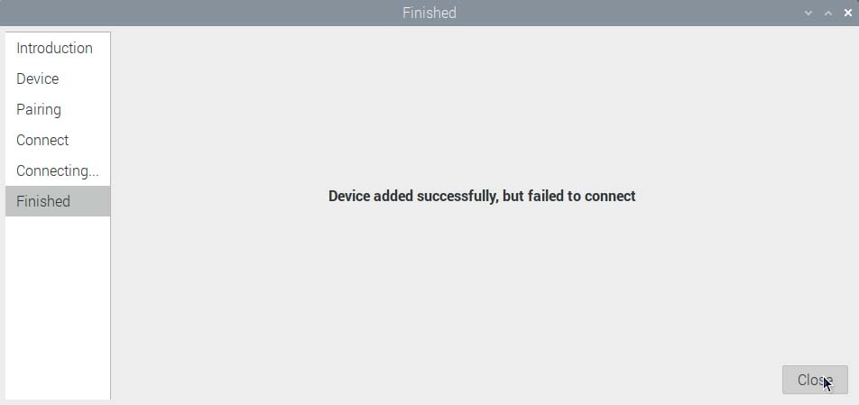

In the above, *Device added successfully, but failed to connect*.  It didn't really fail.  The OBD dongle is now accessible.

Don't expect the Raspberry Pi to automatically connect to the OBD device after rebooting.  How to automatically reconnect to Bluetooth devices is covered later in this documentation.

## LICENSE

[MIT License](../LICENSE.md)
